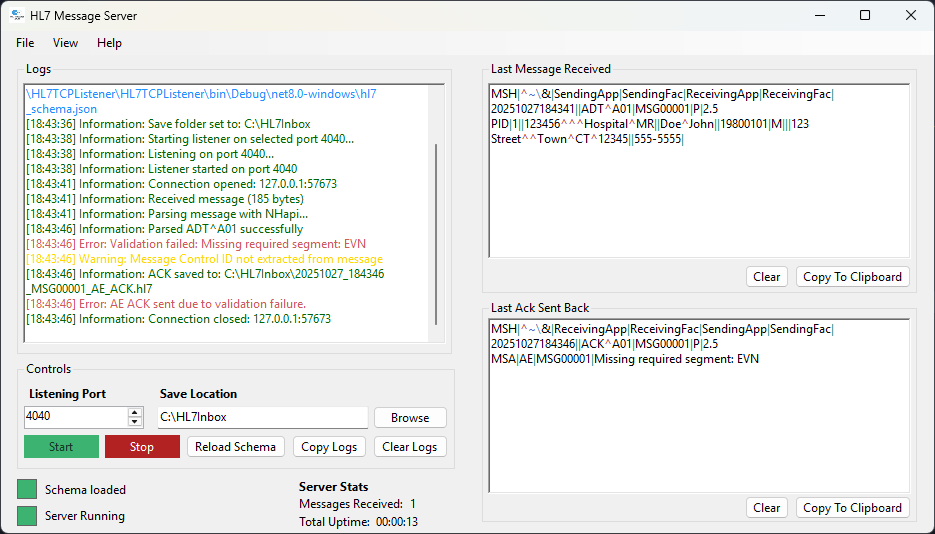

# 🧬 HL7 Message Server

A lightweight Windows application for receiving, validating, and acknowledging HL7 messages over TCP (MLLP).  
Built with **.NET 8**, **NHapi**, and a focus on clarity, diagnostics, and simplicity, ideal for local testing or integration development environments.

---

## 🖼️ Application Preview

---

## ✨ Features

- ⚡ **Real-time HL7 listener** – Receives messages via MLLP over TCP/IP.  
- 🧾 **Structured message logging** – Each inbound message is timestamped and stored in a designated folder.  
- 🔍 **Schema validation** – Optional HL7 schema validation using configurable JSON definitions.  
- 🩺 **Automatic ACK generation** – Builds version-specific acknowledgements (AA, AE, AR).  
- 🪶 **Clean user interface** – Simple, colour-coded status indicators and live message viewer.  
- 💾 **Session persistence** – Remembers last used port and save location.  
- 🧠 **Tray mode** – Minimise to the Windows system tray with quick Start/Stop controls.  
- 🧩 **Extensible design** – HL7 parsing and validation implemented through modular, testable classes.  

---

## 🚀 How To Use

1. Launch the application.
2. Set the **listening port** and **save location** for incoming HL7 messages.
3. Click **Start** to begin listening.
4. Send HL7 messages to your configured port using your preferred HL7 sender or integration engine.
5. Watch messages appear in the live log and message viewer panes.
6. Stop or minimise to tray when finished.

---

## ⚙️ Installing

- **Option 1:** Run the compiled `.exe` from the Releases page.  
- **Option 2:** Build the project from source using Visual Studio 2022 or later.  
  - Requires `.NET 8 SDK`  
  - Recommended: Windows 10 or later  

---

## 🆘 Help

If you need assistance or want to learn more, check out the **[Wiki](https://github.com/rich-howell/HL7MessageServer/wiki)** within this repository.  
It includes guides on:
- Understanding the schema system  
- Configuring validation rules  
- Testing with HL7 senders  
- Troubleshooting connection or ACK issues  

---

## 🐞 Issues

If you discover a bug or have a feature request, please open a new issue in the  
**[Issues](https://github.com/rich-howell/HL7MessageServer/issues)** section of this repository.  

---

## 💡 Credits
 
Powered by **NHapi**, **.NET 8**, and **a clinically precise cup of coffee** ☕

